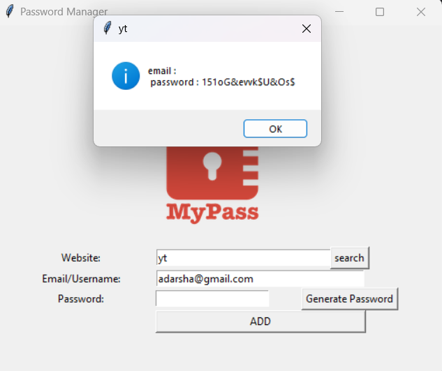
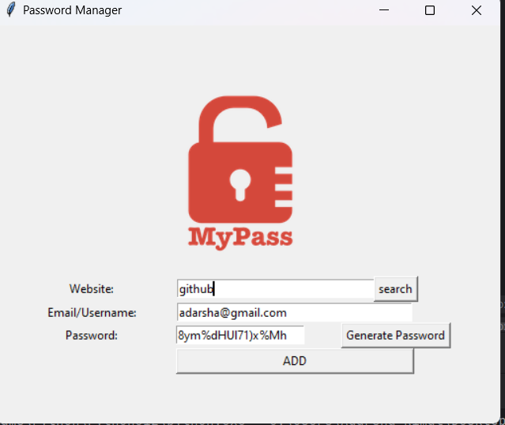

# Password Manager

This is a simple Password Manager application built using Python's Tkinter library. The application allows you to generate secure passwords, save them along with associated website information and email/username, and retrieve them when needed.

## Features

- **Password Generator**: Generates a strong and random password containing letters, numbers, and symbols.
- **Save Password**: Stores passwords securely in a JSON file along with the associated website and email/username.
- **Search Functionality**: Allows you to search for saved passwords by website name.
- **User Interface**: A simple and user-friendly GUI built with Tkinter.

## Installation

1. **Clone the Repository**:

    ```bash
    git clone https://github.com/your-username/password-manager.git
    ```

2. **Navigate to the Project Directory**:

    ```bash
    cd password-manager
    ```

3. **Install Dependencies** (Optional):

    This project relies only on Python's standard library, so there are no additional dependencies. However, ensure you have Python installed.

4. **Run the Application**:

    ```bash
    python password_manager.py
    ```

## Usage

1. **Generate a Password**: 
   - Click on the "Generate Password" button to generate a random password. The generated password will be automatically filled into the password entry field.

2. **Save a Password**:
   - Enter the website name, email/username, and password, then click the "ADD" button. The information will be saved to `data.json`.

3. **Search for a Password**:
   - Enter the website name in the website field and click the "search" button. If the website is found in the data, the associated email and password will be displayed in a pop-up window.

## Project Structure

- `password_manager.py`: The main Python script that runs the application.
- `data.json`: The JSON file where all passwords, emails, and website data are stored.
- `logo.png`: The logo image displayed in the application.

## Screenshots




## Contributing

If you'd like to contribute to this project, please fork the repository and submit a pull request. All contributions are welcome!

## License

This project is licensed under the MIT License. See the [LICENSE](LICENSE) file for details.
